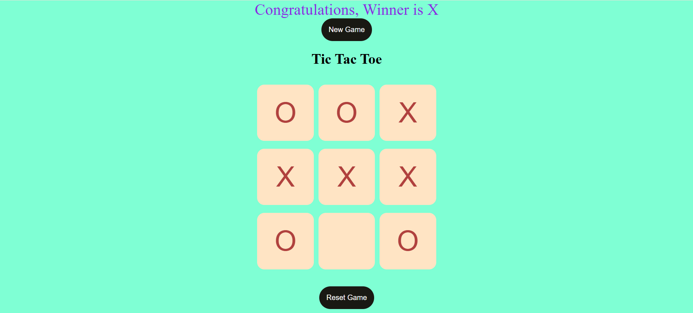

# Tic Tac Toe Game ❌⭕  



A simple browser-based Tic Tac Toe game built using **HTML, CSS, and JavaScript**.  
This project demonstrates core JavaScript concepts such as **DOM manipulation, event handling, and game logic implementation**.

---

## 🚀 Live Demo

https://tic-tac-toe-80aw.onrender.com

---

## ✨ Features

- Two-player gameplay
- Automatic win detection
- Draw detection
- Restart game functionality
- Clean and responsive UI
- Interactive game board

---

## 🛠 Tech Stack

- HTML5
- CSS3
- JavaScript

---

## 🧠 Skills Demonstrated

- DOM manipulation
- Event handling
- Game logic implementation
- UI layout design
- Interactive web development

---

## ⚙️ Run Locally

1. Clone the repository

```
git clone https://github.com/IshaanSaxena2005/tic-tac-toe.git
```

2. Open the project folder

3. Run `index.html` in your browser

---

## 👨‍💻 Author

**Ishaan Saxena**  
B.Tech CSE (Big Data Analytics)  
SRM Institute of Science and Technology  

GitHub:  
https://github.com/IshaanSaxena2005

---

⚠️ This project was created for learning JavaScript game logic and frontend development.
